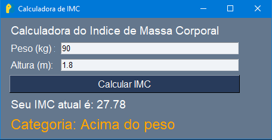

<<<<<<< HEAD:README.md
=======

>>>>>>> 328f3d9a278e80c90f77b086020d85a336e18ab5:README.me
  

<h1 align="center">Calculadora de IMC (Índice de Massa Corporal)</h1>

<<<<<<< HEAD:README.md
*Graduando em Ciência de Dados na Uninter e Cursando Mestres da Automação*
=======
*Graduando em Ciência de Dados na Uninter e Mestres da Automação*
>>>>>>> 328f3d9a278e80c90f77b086020d85a336e18ab5:README.me

Este é um projeto simples de uma Calculadora de IMC (Índice de Massa Corporal) desenvolvida em Python utilizando a biblioteca PySimpleGUI para a interface gráfica.

<h2 align="left">Funções do Projeto:</h3>

<h3 align="left">Interface Gráfica:</h3>

A interface gráfica foi construída utilizando a biblioteca PySimpleGUI, permitindo uma experiência interativa e amigável para o usuário. Inclui campos para inserir o peso e a altura, onde o usuário pode digitar os valores e calcular o IMC com um clique no botão "Calcular IMC". Há validações para garantir que os campos não estejam em branco e que aceitem apenas números.

<h3 align="left">Cálculo do IMC:</h3>

O cálculo do IMC é realizado utilizando a fórmula padrão: IMC = peso / (altura * altura). Após calcular o IMC, o resultado é exibido na interface com duas casas decimais e colorido conforme a faixa de valores (gradiente de cores de acordo com o IMC).

<h3 align="left">Validações de Entrada:</h3>

Antes de calcular o IMC, o sistema verifica se os campos de peso e altura estão preenchidos. Valida também se os valores inseridos são numéricos e se a altura está dentro do intervalo aceitável (0.3 a 3.0 metros).

<h3 align="left">Imagem do Resultado:</h3>

<<<<<<< HEAD:README.md

=======

<h3 align="left">Como Executar:</h3>

Para executar a calculadora de IMC localmente:

1. Clone este repositório.
2. Certifique-se de ter Python instalado em seu sistema.
3. Instale a biblioteca PySimpleGUI, se ainda não estiver instalada (`pip install PySimpleGUI`).
4. Execute o arquivo `calculadora_imc_gui.py` usando Python.
>>>>>>> 328f3d9a278e80c90f77b086020d85a336e18ab5:README.me
